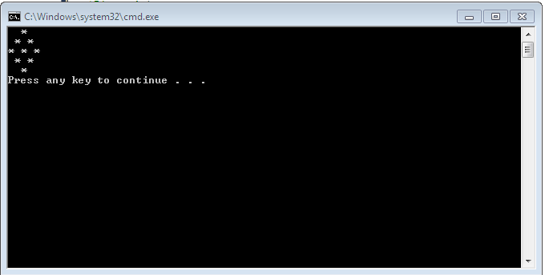
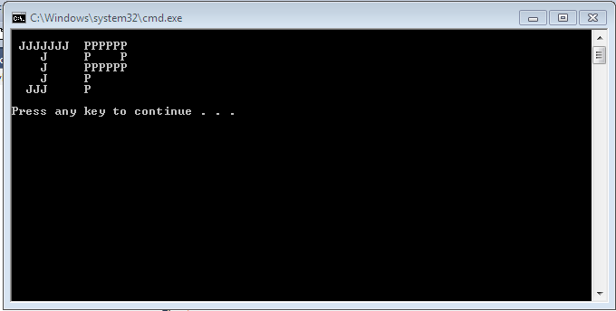

# Week 1 Lab

## Table Of Contents

1. [Running The Project](#running-the-project)
2. [Instructions](#instructions)
3. [Technologies Used](#technologies-used)

## Running the Project
1. Download the source code
2. If downloading as .zip file, extract to your machine
3. Ensure JDK is installed on your machine and `java` and `javac` are available on your path
4. Navigate to the package directory at `./src`
5. Run `javac io/bryanmullen/Main.java` to compile the class file
6. Run `java io/bryanmullen/Main` to run the project from the command line

## Instructions
Lab 1:
Please try to complete each of the following problems. You can put them all into 1 file, or split them across multiple files

Create print statements that look like the following:

Diamond Formation
Challenge: Create a diamond formation of * characters

Initials
Challenge: Create large letters using basic letter printing. Letter should match your initials. Contact lecturer if unsure

## Technologies Used
- JAVA
- Github

[BACK TO TOP](#week-1-lab)